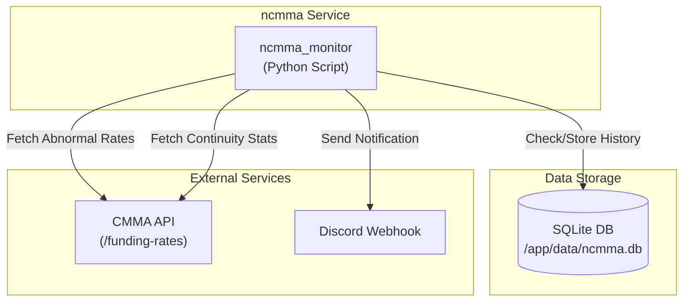

<!-- START doctoc generated TOC please keep comment here to allow auto update -->
<!-- DON'T EDIT THIS SECTION, INSTEAD RE-RUN doctoc TO UPDATE -->
**Table of Contents**  *generated with [DocToc](https://github.com/thlorenz/doctoc)*

- [funding-ncmma (Discord Notification Daemon)](#funding-ncmma-discord-notification-daemon)
  - [概要](#%E6%A6%82%E8%A6%81)
  - [機能](#%E6%A9%9F%E8%83%BD)
  - [必要要件](#%E5%BF%85%E8%A6%81%E8%A6%81%E4%BB%B6)
  - [実行方法](#%E5%AE%9F%E8%A1%8C%E6%96%B9%E6%B3%95)
    - [1. 環境変数の設定](#1-%E7%92%B0%E5%A2%83%E5%A4%89%E6%95%B0%E3%81%AE%E8%A8%AD%E5%AE%9A)
    - [2. デーモンの起動](#2-%E3%83%87%E3%83%BC%E3%83%A2%E3%83%B3%E3%81%AE%E8%B5%B7%E5%8B%95)
    - [3. 動作確認](#3-%E5%8B%95%E4%BD%9C%E7%A2%BA%E8%AA%8D)
  - [アプリケーションの停止](#%E3%82%A2%E3%83%97%E3%83%AA%E3%82%B1%E3%83%BC%E3%82%B7%E3%83%A7%E3%83%B3%E3%81%AE%E5%81%9C%E6%AD%A2)
  - [システム構成](#%E3%82%B7%E3%82%B9%E3%83%86%E3%83%A0%E6%A7%8B%E6%88%90)
    - [Mermaid ダイアグラム](#mermaid-%E3%83%80%E3%82%A4%E3%82%A2%E3%82%B0%E3%83%A9%E3%83%A0)

<!-- END doctoc generated TOC please keep comment here to allow auto update -->

# funding-ncmma (Discord Notification Daemon)

## 概要
`ncmma` は、`cmma` API から資金調達率（Funding Rate）データを定期的に取得し、設定された閾値以上の異常な金利が発生した場合にDiscordチャンネルに通知を送信するデーモンです。
単なる金利の通知だけでなく、その状態の「継続性（過去どれくらい頻繁に起きているか）」も分析して通知に含めます。

- [GitHub - deg-labs/cmma: Bybitの上場銘柄から上昇率を取得するAPIサーバ](https://github.com/deg-labs/cmma)

このデーモンは、`cmma` APIサーバーが別途稼働していることを前提としています。

## 機能
- **Funding Rate 監視**: `cmma` APIの `/funding-rates` エンドポイントから異常な金利データを取得します。
- **継続性分析**: `/funding-rates/extreme-continuity` エンドポイントを利用し、異常状態の統計指標を取得・通知します。
  - **連続継続率**: 直近で連続して発生している割合
  - **期間内発生率**: 指定期間全体での発生頻度
  - **平均ラン長**: 異常状態が続く平均的な期間の長さ
- **Discord 通知**: 異常金利とその統計情報をDiscordに通知します。
- **重複通知防止**: SQLiteデータベースに通知履歴を保存し、一定時間（デフォルト4時間）内の再通知を防ぎます。
- **柔軟な設定**: `.env` ファイルで閾値、監視間隔、通知バッファ時間などを設定可能です。
- **Docker/Docker Compose 対応**: Dockerコンテナとして簡単にデプロイ・実行が可能です。

## 必要要件
- Docker
- Docker Compose

## 実行方法

### 1. 環境変数の設定
`ncmma` デーモンは、`ncmma/.env` ファイルから設定を読み込みます。
`ncmma/.env.example` を参考に、`ncmma/.env` ファイルを作成し、必要な環境変数を設定してください。

```shell
cp ncmma/.env.example ncmma/.env
```

`ncmma/.env` で以下の変数を設定できます（詳細は `.env.example` を参照）。
- `DISCORD_WEBHOOK_URL`: DiscordのWebhook URL（必須）
- `CMMA_API_BASE_URL`: CMMA APIのベースURL
- `FUNDING_RATE_THRESHOLD`: 異常と判断する金利の閾値 (例: `0.001` = 0.1%)
- `FUNDING_RATE_LOOKBACK`: 継続性分析で遡る回数 (例: `24`)
- `RENOTIFY_BUFFER_MINUTES`: 同一シンボル・方向の再通知を防ぐ時間（分）
- `CHECK_INTERVAL_SECONDS`: APIチェックサイクルの間隔（秒）

### 2. デーモンの起動
プロジェクトルートで以下のコマンドを実行し、デーモンをビルドして起動します。

初回起動時はフォアグラウンドで実行してログを確認することをお勧めします。
```shell
docker-compose up --build
```

問題がなければ、`-d`オプションを付けてバックグラウンドで実行します。
```shell
docker-compose up --build -d
```

### 3. 動作確認
ログを確認して動作状況をチェックします。
```shell
docker-compose logs -f funding-ncmma-notifier
```

## アプリケーションの停止

```shell
docker-compose down
```
ボリューム（`./ncmma/data/ncmma.db`ファイルなど）は削除されません。履歴をリセットしたい場合は、手動で`./ncmma/data/ncmma.db`ファイルを削除してください。

## システム構成

`ncmma` デーモンは、外部の `cmma` APIにアクセスし、その結果に基づいてDiscordに通知を送信します。

### Mermaid ダイアグラム

